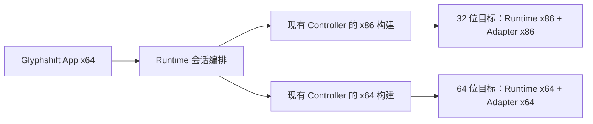

# 双架构软件的实际做法与 Glyphshift 候选方案

研究日期：2026-09-07。仅做第一方文档、固定源码快照与本仓库调用链分析；没有移植代码、构建 x86、启动新注入测试，也没有决定最终实现。比较的是普通 Windows x86/x64 工件，不讨论 ARM64X 等其他混合映像机制。

## 结论

用户要求的形态成立：**一个适配器身份、一份设置、多架构原生工件，由 Runtime 按实际目标架构匹配。主 App 继续 x64。**

不能把“需要对应架构的目标内代码”推导成“必须新增独立常驻助手”。外部项目同时存在直接跨位数连接、按需同位数助手和短命启动助手。对 Glyphshift，优先候选应是**复用现有 Controller，分别编译 x86/x64**，而不是默认再加一层 Main Controller → Helper。

这仍是建议，不是已证明成本最低的最终决定。必须先验证混合位数进程族、静态包元数据/同位数检查器及会话路由。

## 四个实际参照

| 项目 | 用户/上层视角 | 工件组织 | 连接方式的源码事实 | 借鉴边界 |
| --- | --- | --- | --- | --- |
| Windhawk | 一个 mod 身份与源码 | 同一源码按架构输出，engine/mods 有 32/64 目录 | 已检查入口选择目标架构 shellcode 和 engine DLL，直接承担跨位数注入 | 最接近“一个适配器多架构”；不能照搬全进程服务、WOW64 特殊代码或假设 mod 自动恢复所有改动 |
| OBS Studio | 一项游戏捕获功能 | 分别生成 graphics-hook32/64、inject-helper32/64；x86 子构建不要求第二个完整 UI | 同架构且非兼容路径直接注入；跨架构或兼容路径启动对应 helper | 可借鉴架构工件与就绪状态；App 内插件和目标内 hook 是不同层，捕获成功不等于文字替换成功 |
| Frida Windows | 一个 attach/inject 接口 | AgentDescriptor 持有不同 CPU 的 agent 工件 | 同 CPU 使用 in-process backend；跨 CPU 由 helper manager 路由到匹配架构 backend，权限失败有另一路径 | 可借鉴接口隐藏差异；manager/backend 有自己的任务寿命，不能任意提前关闭 |
| Microsoft Detours | 统一进程创建/注入入口 | 成对 x86/x64 DLL | 跨位数路径可用匹配架构的 rundll32 helper，等待其工作完成后退出 | 说明助手可以短命；该路径针对新建挂起进程的导入表更新，不是现成的运行中附加方案 |

以上分别由固定源码与构建文件支持：

- [Windhawk 多目标编译](https://github.com/ramensoftware/windhawk/blob/61d99ed8e182e1af1b60109612b6763ad1b4b74e/src/windhawk-core/core/src/services/compiler/orchestrate.rs#L187-L320)、[直接注入入口](https://github.com/ramensoftware/windhawk/blob/61d99ed8e182e1af1b60109612b6763ad1b4b74e/src/windhawk/engine/dll_inject.cpp#L675-L835)。
- [OBS 架构路由](https://github.com/obsproject/obs-studio/blob/6b3e550729f125b6c5b3767df88c08f5aef9d264/plugins/win-capture/game-capture.c#L839-L964)、[双架构构建](https://github.com/obsproject/obs-studio/blob/6b3e550729f125b6c5b3767df88c08f5aef9d264/cmake/windows/architecture.cmake)。
- [Frida Windows backend 选择](https://github.com/frida/frida-core/blob/39583a2761627c6dfaf90c78761d38c83914268a/src/windows/frida-helper-process.vala#L59-L97)、[agent 工件](https://github.com/frida/frida-core/blob/39583a2761627c6dfaf90c78761d38c83914268a/src/windows/winjector.vala#L132-L161)。
- [Detours 官方双架构说明](https://github.com/microsoft/Detours/wiki/OverviewHelpers)、[等待 helper 退出的实现](https://github.com/microsoft/Detours/blob/adb07604aa56508448b95bf037c2a6d0d3b6831a/src/creatwth.cpp#L1342-L1430)。

这些是研究时的固定源码快照，部分来自默认开发分支，不等于每个已发布安装版本都完全相同；本轮也未做代码移植的许可证审查。详细证据、异常分支及限制见 [Windhawk/OBS 报告](comparison-windhawk-obs.md) 和 [Frida/Detours 报告](comparison-frida-detours.md)。

## 操作系统要求和工程选择要分开

**硬要求：** 普通 x86 进程加载 x86 原生 DLL，普通 x64 进程加载 x64 原生 DLL。二者可以通过 IPC 通信；一个 DLL 文件不能因为描述符同时声明两种架构就变成双位数可执行映像。[Microsoft Process Interoperability](https://learn.microsoft.com/en-us/windows/win32/winprog64/process-interoperability)

**工程选择：** 哪个位数的控制进程做加载、要不要助手、助手是否常驻、App 是否内置更多 PE/机器码处理。直接跨位数并不被上述 DLL 加载规则一概禁止；Windhawk 是维护额外实现的实际例子。它省掉的是某条路径上的额外助手进程，不是目标架构适配工作。

**权限是另一维度：** 对应架构的 helper 本身不会自动获得管理员权限。架构匹配、权限足够、Runtime 加载、Adapter 可用、译文可见与恢复成功都必须分别判断。

## 对照仓库后，为什么值得先复用 Controller

本项目已经具备这一拆分的部分基础：

1. `controller/windows/src/main.rs:1` 本来就是一个调用 `serve_stdio(WindowsController::new())` 的独立程序。
2. `controller/host/src/lib.rs:180` 以隐藏窗口方式启动它，通过标准输入输出传协议；UI 不直接调用它的原生函数指针。
3. `desktop/src/bundle.rs:520` 在发现目标会话时启动 Controller，`desktop/src/pool.rs:135` 管理各软件的独立 Runtime 会话。

因此让原 Controller 源码分别生成 x86/x64 工件，放进相应 Runtime 架构包，是一个需要验证但有复用基础的方案。它仍是现有角色的两种编译结果，**无需在用户层新增“x86 助手”对象，也不必预设再套一个中转进程**。

以上路径相对 `crates/runtime/`。当前发现目标的逻辑也在 Controller 内，不能仅把 spawn 路径改成一个 if 就宣布完成：架构在何处首次识别、启动器与后代进程位数不同怎么办，都需要明确协议与所有权。

## 三个候选连接实现

| 候选 | 具体结构 | 对现有代码的适配 | 代价与风险 | 初步判断 |
| --- | --- | --- | --- | --- |
| A：Controller 双编译 | x64 App → 对应架构 Controller → 对应目标 Runtime/Adapter | 复用现有 stdio、远程部署、诊断和会话清理 | 需架构路由、多工件 Catalog、同位数包检查；混合进程族可能需要多个内部连接 | 优先研究/原型验证，新增角色最少 |
| B：短命注入 broker | App/Controller → broker 完成加载 → 与目标 agent 直接通信 | 可借鉴 OBS/Detours 的短命辅助进程概念 | 当前 capture/trace/publication 依赖 Controller 的远程调用；要让 broker 退出，需新增目标 IPC、就绪握手、认证和断线恢复 | 可作为后续优化，不应以为仅改进程寿命即可 |
| C：x64 Controller 直接跨位数 | 原 Controller 按目标位数生成/解析布局、入口与加载数据 | 保持单类控制进程 | 需要目标 PE/转发导出解析、x86 入口与结构布局；维护和故障定位范围更大 | 有成熟先例，但首版未必更省事 |

三种实现都应满足同一个连接 interface，业务层只提交目标身份和适配器要求。暂不把三种实现全写出来，也不为假想的未来后端创建一堆抽象层。

## 建议的用户目录、包目录和运行进程

这三种图必须区分；文件夹不是进程，进程也不是用户可选择的适配器。

用户只看到一次 `TextOutW` 或 `Qt Painter`。包目录可以是下列示意，**不是已定稿清单格式**：

```text
Runtime Bundle
├─ manifest：逻辑 Adapter ID、版本、各架构工件与哈希
├─ windows-x86
│  ├─ controller.exe
│  ├─ runtime.dll
│  └─ adapters/...
└─ windows-x86_64
   ├─ controller.exe
   ├─ runtime.dll
   └─ adapters/...
```

候选 A 的运行关系：



架构匹配应依据实际进程信息并在部署时复核，查询失败明确拒绝，不猜位数。只有同一个适配器的某架构工件尚未提供时，才向用户说明当前目标不兼容；不让用户手动挑一个 DLL。

## “Core 架构无关”的准确含义

词典匹配和决策的源码可以共用，但不能由此推导“所有代码只能运行在 x64 App”。当前 `targets/runtime/src/lib.rs:12`、`:52`、`:523` 已在目标 Runtime 内使用 RuntimeKernel 完成本地决策；`contract/src/lib.rs` 的 RuntimePublication 用 serde 传递不可变发布内容。

应保留这种分工：App 管理词典与翻译任务，把发布快照送到目标；目标内 hook 使用对应架构编译的相同决策代码。**不要为了让 Core 只剩一个实例，把每次绘制都改成跨进程向 App 请求译文。** 那会把控制消息通道变成高频绘制路径，带来额外等待与故障耦合。

## 必须先补齐的仓库问题

- **注册表身份：** 当前 `adapters/platform/registry/src/lib.rs:259` 以 AdapterId + Version 唯一索引，同一 ID/版本第二份不同哈希会被当成内容冲突。多架构变体必须正式建模，不能简单向 adapters 数组追加另一份 DLL，也不能给用户拆成两个名字。
- **单架构 Bundle：** `runtime/desktop/src/bundle.rs:9` 只有一个 controller/runtime；`:296` 在 App 中直接加载 Adapter DLL 读 descriptor。x86 工件必须由同位数检查器读，或改为构建产出的可校验静态元数据并在目标加载时复验；不能为了支持 x86 跳过校验。
- **进程内 ABI：** Native ABI 含指针/函数指针，跨位数控制协议只能传序列化值，不能原样复制结构。目标内 Runtime 与 Adapter 则保持同位数 ABI。
- **目标身份：** 启动器可能是 x64，而真正窗口宿主/子进程为 x86；不凭一个安装文件或父进程决定整个进程族的架构。跨 Controller 不能直接复用另一会话的 opaque target ID。
- **版本与部分可用性：** 同一逻辑 Adapter 的不同架构可能暂时提供不同能力。按目标工件检查要求；缺少 x86 Qt 时仍让 x64 Qt 正常工作，不能把能力并集当作每个目标均支持。
- **生命周期：** 明确关闭窗口、目标退出、Controller 崩溃、超时、停用恢复和驻留版本升级。助手成功退出或远程线程建立均不等于 Runtime 就绪；已有热更新/恢复语义不能在架构重构中丢失。

上列路径以 `crates/` 为根；位数识别、远程导出计算等更细的现状见 [初轮 x86 审计](x86-feasibility.md)。

## 进入实现前的最小验证计划

1. 用同一适配器 ID / 版本的两份最小工件验证 Catalog 不重复显示、不冲突，并能逐个核对 hash、PE machine 和 ABI。
2. 用现有 Controller 的双编译结果验证候选 A：同一 x64 App 的接口能连接 x86 与 x64 合成宿主。明确发现与分发流程，再决定是否需要独立 broker。
3. 构造 x64 启动器 → x86 窗口宿主、位数查询失败、工件缺失/错误、权限不足、旧进程 ID 复用等拒绝场景。
4. 首个真实文字范围只做 GDI；保持采集、首代与第二代译文、字体、停用恢复和再连接的原有验收，不用全部 Qt/MonoGame 移植阻塞基础设施。

此计划是接下来要验证的内容，不是已完成测试。x86 首版仍属于中等工程；经比较，目前没有理由把整个 Core / UI 重写成 32 位，也没有证据证明照搬 Windhawk 的跨位数底层能比复用 Controller 更快。
